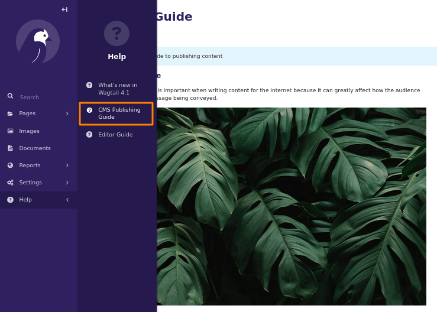
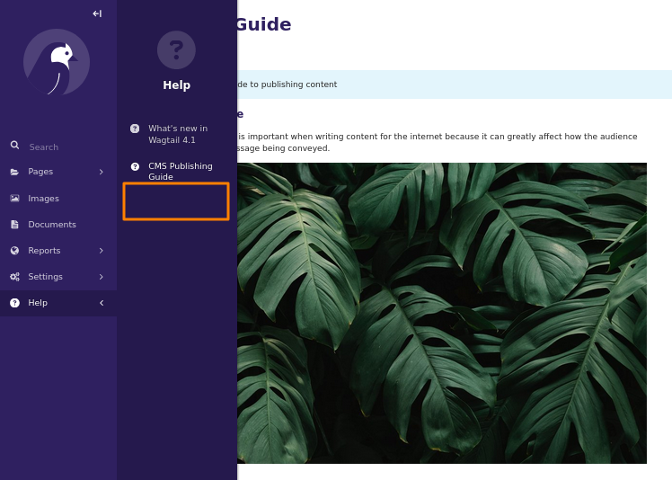
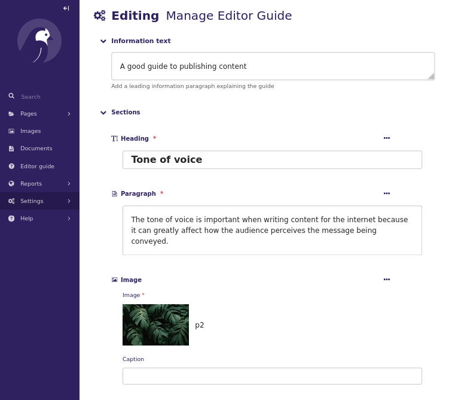
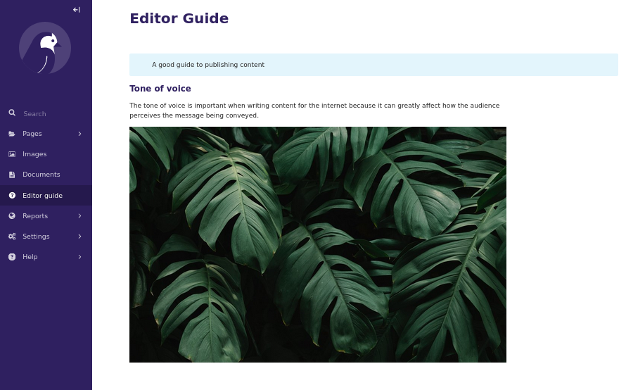

# Wagtail Guide

 [](https://codecov.io/gh/kevinhowbrook/wagtailguide)

## What is it?

The Wagtail Guide app adds functionality for creating and editing a guide for editors and publishers to help them create good content.

## Installation

Wagtailguide has a pypi package and can be installed with:

```bash
pip install wagtail-guide
```

After installing, add it to your settings file along with `wagtail.contrib.settings`, the settings inclusion should be placed with your other wagtail.contrib libraries:

```python
INSTALLED_APPS = [
    ...
    'wagtail_guide',
    'wagtail.contrib.settings',
]
```

## Settings and configuration

Wagtail guide has some customisation options...

**WAGTAIL_GUIDE_MENU_LABEL**
Use this setting to define your own menu label for viewing the guide.

**ADD_WAGTAIL_GUIDE_TO_HELP_MENU**
This setting will place the guide within the 'Help' menu.

**HIDE_WAGTAIL_CORE_EDITOR_GUIDE**
You can use this setting to turn off the Wagtail core Editor Guide link

### Examples of customisation via settings

Here is an example of a custom menu label (outlined here in orange),
and placing the editor guide link in the help menu:

```python
WAGTAIL_GUIDE_SETTINGS = {
    "ADD_WAGTAIL_GUIDE_TO_HELP_MENU": True,
    "WAGTAIL_GUIDE_MENU_LABEL": "CMS Publishing Guide",
    "HIDE_WAGTAIL_CORE_EDITOR_GUIDE": False,
}
```



Here is an example of hiding the core Editor Guide link and just using ours:

```python
WAGTAIL_GUIDE_SETTINGS = {
    "ADD_WAGTAIL_GUIDE_TO_HELP_MENU": True,
    "WAGTAIL_GUIDE_MENU_LABEL": "CMS Publishing Guide",
    "HIDE_WAGTAIL_CORE_EDITOR_GUIDE": True,
}
```



You can define them in your project settings file like this:

```python
WAGTAIL_GUIDE_SETTINGS = {
    "ADD_WAGTAIL_GUIDE_TO_HELP_MENU": False,
    "WAGTAIL_GUIDE_MENU_LABEL": "WG guide menu label",
    "HIDE_WAGTAIL_CORE_EDITOR_GUIDE": True,
}
```

## Usage

To edit the guide, the user needs to be an admin, or have the `Manage editor guide` 'change' value checked in their user group permissions.

### Editing the guide

To edit the guide, from the left hand menu open settings > then click 'Manage editor guide'. Edit your content and then save.



#### Guide navigation menu

If more than one 'heading' blocks are added to the content, an automatic menu will be displayed at the top of the guide under the heading 'Contents'

### Viewing the guide

Once logged in, a new menu icon towards the bottom of the left hand menu will be visible labeled as 'Editor guide':



## Dependencies

Wagtail Guide requires `wagtail>=5.2`

## Contributing

We welcome contributions to this project, see [CONTRIBUTING.md](docs/CONTRIBUTING.md) for more details.
